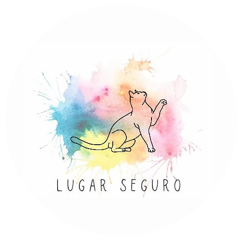

## Tabela de conteúdos
<a href="#logo"> Logo </a>  
<a href="#descricao"> Descrição </a>  
<a href="#visitar"> Visitar o Site </a>  
<a href="#status"> Status do Projeto </a>  
<a href="#caracteristicas"> Características </a>  
<a href="#tecnologias"> Tecnologias </a>  
<a href="#screenshot"> Screenshot </a>

<a name="logo"/>

## Logo

  

<a name="descricao"/>

## Descrição
Site institucional da ONG Lugar Seguro.

<a name="visitar"/>

## Visitar o Site
<a target="_blank" rel="noopener noreferrer" href="http://limaprogramming.atwebpages.com/LugarSeguro/"> Lugar Seguro </a>

<a name="status"/>

## Status do Projeto
Finalizado

<a name="caracteristicas"/>

## Características
- [x] Site Institucional
- [x] Loja Virtual 

<a name="tecnologias"/>

## Tecnologias
- HTML
- CSS
- JAVASCRIPT
- PHP

<a name="screenshot"/>

## Screenshot

### Página Inicial:

